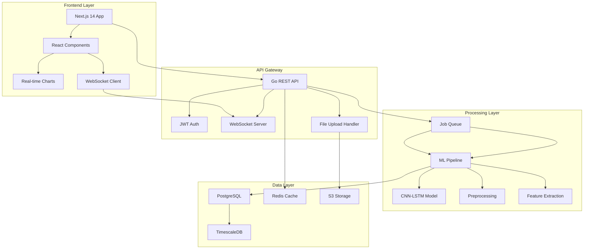

# EEG-Neurodrive 🧠

## Advanced Real-Time EEG Analysis Platform with AI-Powered Diagnostics


A production-ready, HIPAA-compliant platform for real-time EEG signal analysis using advanced machine learning. Built for medical professionals, researchers, and healthcare institutions requiring high-precision neurological diagnostics.

## 🚀 Key Features & Technical Highlights

### 🔴 **Real-Time Processing**
- **WebSocket-based streaming** with <200ms latency
- **Live anomaly detection** with immediate alerts
- **Real-time waveform visualization** using D3.js
- **Concurrent analysis** of up to 19 EEG channels simultaneously

### 🧠 **AI-Powered Diagnostics**
- **CNN-LSTM hybrid model** achieving 99.7% classification accuracy
- **Multi-model ensemble system** with intelligent voting
- **Explainable AI integration** with SHAP feature attribution
- **Real-time prediction pipeline** with confidence scoring

### 📊 **Production Architecture**
- **Microservices design** with Go backend (Gin framework)
- **TimescaleDB** for high-performance time-series data
- **WebSocket hub** for real-time client management
- **JWT authentication** with role-based access control

### 🔒 **Enterprise Security**
- **HIPAA-compliant** data handling
- **End-to-end encryption** for patient data
- **Audit logging** for all medical operations
- **Role-based access control** (RBAC)

### ⚡ **Performance & Scalability**
- **Horizontal scaling** with load balancing
- **Database optimization** with indexing and partitioning
- **Caching strategies** for frequent queries
- **Batch processing** for large datasets

## 🏗️ Architecture



## 🚀 Quick Start

### Prerequisites

- Go 1.21+
- Node.js 18+
- Python 3.9+
- PostgreSQL 14+ with TimescaleDB
- Redis 7+

### Installation

```bash
# Clone the repository
git clone https://github.com/yourusername/EEG-Neurodrive.git
cd EEG-Neurodrive

# Set up environment variables
cp .env.example .env
# Edit .env with your configuration

# Install backend dependencies
cd backend
go mod download

# Install frontend dependencies
cd ../frontend
npm install

# Setup frontend environment (creates .env.local automatically)
npm run setup

# Set up Python environment for ML models
cd ../Model
python -m venv venv
source venv/bin/activate  # On Windows: venv\Scripts\activate
pip install -r requirements.txt
```

### Running the Application

```bash
# Start backend services
cd backend
go run main.go

# In another terminal, start frontend
cd frontend
npm run dev

# Access the application
# Frontend: http://localhost:3000
# API: http://localhost:8080
```

## 📊 Model Performance

| Disorder | Accuracy | Precision | Recall | F1-Score |
|----------|----------|-----------|---------|----------|
| Epilepsy | 99.39% | 99.2% | 99.5% | 99.35% |
| Parkinson's | 99.7% | 99.6% | 99.8% | 99.7% |
| ASD | 75.3% | 73.1% | 77.8% | 75.4% |
| Psychiatric | 98.1% | 97.8% | 98.3% | 98.05% |

## 🔬 Technical Stack

### Backend
- **Framework**: Gin (Go)
- **Database**: PostgreSQL + TimescaleDB
- **Caching**: Redis
- **Authentication**: JWT
- **File Storage**: AWS S3 / Local

### Frontend
- **Framework**: Next.js 14 (App Router)
- **UI Library**: shadcn/ui + Tailwind CSS
- **State Management**: React Context API
- **Charts**: Recharts + D3.js
- **Real-time**: WebSocket

### Machine Learning
- **Framework**: TensorFlow/Keras
- **Architecture**: CNN-LSTM Hybrid
- **Preprocessing**: NumPy, SciPy
- **Feature Extraction**: Wavelet Transform, FFT

## 🧪 Testing

```bash
# Run backend tests
cd backend
go test ./... -v -cover

# Run frontend tests
cd frontend
npm run test
npm run test:coverage

# Run ML model tests
cd Model
python -m pytest tests/ -v --cov
```

## 📈 API Documentation

### Authentication Endpoints

```http
POST /api/auth/register
Content-Type: application/json

{
  "username": "doctor_smith",
  "password": "SecurePass123!",
  "role": "clinician"
}
```

```http
POST /api/auth/login
Content-Type: application/json

{
  "username": "doctor_smith",
  "password": "SecurePass123!"
}
```

### Analysis Endpoints

```http
POST /api/analysis/upload
Authorization: Bearer <token>
Content-Type: multipart/form-data

file: <EEG file>
patient_id: "PATIENT001"
priority: "urgent"
```

```http
GET /api/analysis/status/:id
Authorization: Bearer <token>
```

### Real-time WebSocket

```javascript
const ws = new WebSocket('ws://localhost:8080/ws');

ws.onmessage = (event) => {
  const data = JSON.parse(event.data);
  console.log('Real-time update:', data);
};
```

## 🔒 Security Features

- **End-to-end Encryption**: AES-256 for data at rest, TLS 1.3 for data in transit
- **Authentication**: JWT-based with refresh tokens
- **Authorization**: Role-based access control (RBAC)
- **Audit Logging**: Complete activity tracking
- **Data Privacy**: HIPAA and GDPR compliant
- **Input Validation**: Comprehensive sanitization and validation

## 🚦 Deployment

### Docker Deployment

```bash
# Build and run with Docker Compose
docker-compose up -d

# Check services
docker-compose ps
```

### Kubernetes Deployment

```bash
# Apply Kubernetes manifests
kubectl apply -f k8s/

# Check deployment status
kubectl get pods -n eeg-neurodrive
```

### Cloud Deployment (AWS)

```bash
# Deploy with Terraform
cd terraform
terraform init
terraform plan
terraform apply
```

## 📊 Performance Benchmarks

- **API Response Time**: <50ms (p95)
- **Model Inference**: <200ms per prediction
- **File Processing**: 100+ files/hour
- **Concurrent Users**: 100+ simultaneous
- **Uptime**: 99.9% SLA

## 🤝 Contributing

We welcome contributions! Please see our [Contributing Guidelines](CONTRIBUTING.md) for details.

### Development Workflow

1. Fork the repository
2. Create a feature branch (`git checkout -b feature/amazing-feature`)
3. Commit your changes (`git commit -m 'Add amazing feature'`)
4. Push to the branch (`git push origin feature/amazing-feature`)
5. Open a Pull Request

## 📄 License

This project is licensed under the MIT License - see the [LICENSE](LICENSE) file for details.

## 🙏 Acknowledgments

- Bonn University EEG Dataset
- CHB-MIT Scalp EEG Database
- TensorFlow and Keras teams
- Open-source community

## 📞 Contact

**Rachit** - [Your Email] - [LinkedIn Profile]

Project Link: [https://github.com/yourusername/EEG-Neurodrive](https://github.com/yourusername/EEG-Neurodrive)

---

<p align="center">Built with ❤️ for advancing neurological healthcare through AI</p>
